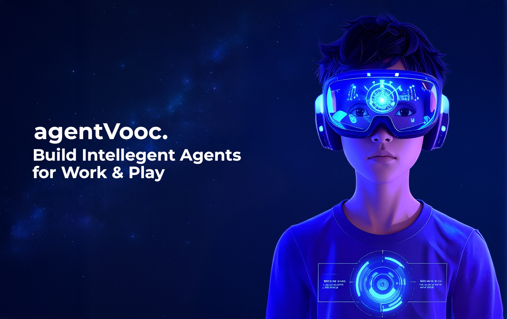

# agentVooc 🤖

<div align="center">
  
</div>

<div align="center">

📖 [Documentation](https://agentvooc.com/company/docs) | 🎯 [Examples](https://github.com/thejoven/awesome-eliza)

</div>


## 🚩 Overview

<div align="center">
  agentVooc is an operating system for AI agents, forked from elizaOS. It powers applications running on agentvooc.com. This is a monorepo that integrates Sanity CMS for managing characters, plugins, and features; Stripe for payments; and SuperTokens for user management.
</div>

## ✨ Features

- 🛠️ Sanity Studio integration for headless character creation
- 🔗 Support for every model (penAI, Gemini, etc.)
- 📚 Document ingestion and interaction.
- 💾 Retrievable memory and document store
- 🚀 Extensible with custom plugins and clients.
- 📦 Integrated with Sanity CMS, Stripe, and SuperTokens.

## Video Tutorials

[Coming Soon]()

## 🚀 Quick Start

### Prerequisites

- [Python 2.7+](https://www.python.org/downloads/)
- [Node.js 23+](https://docs.npmjs.com/downloading-and-installing-node-js-and-npm)
- [pnpm](https://pnpm.io/installation)

> **Note for Windows Users:** [WSL 2](https://learn.microsoft.com/en-us/windows/wsl/install-manual) is required.

> You'll want to create a [Telegram Bot](https://core.telegram.org/bots#how-do-i-create-a-bot).

> You'll want a personal Solana RPC URL. You can get one from [Alchemy](https://www.alchemy.com/) or [Quicknode](https://www.quicknode.com/).

> You'll need an API key from [OpenAI](https://auth.openai.com/log-in) (you can optionally use a different provider like Anthropic, Grok, etc.)

> **OPTIONAL:** Create a [Birdeye](https://bds.birdeye.so/) account and obtain an API key.

### Starting Up

#### 1. Clone/download the repo

#### 2. Install Dependencies:
```bash
`pnpm install`
```

#### 3. Build Project:
```bash
`pnpm build`
```

#### 4. Create .env:
```bash
cp .env.example .env
```

For a basic start you'll want to fill out the following fields:

Setup an LLM
- **OPENAI_API_KEY**

Sanity CMS (Character and Knowledge Management)
- **SANITY_PROJECT_ID=your-project-id**
- **SANITY_DATASET=production (or your dataset name)**
- **SANITY_API_TOKEN=your-api-token**
- **SANITY_API_VERSION=2023-05-03**
- **SANITY_WEBHOOK_SECRET=your-webhook-secret**

Email (Optional, for Email Plugin)
- **EMAIL_OUTGOING_SERVICE=gmail (or smtp)**
- **EMAIL_OUTGOING_USER=your-email@domain.com**
- **EMAIL_OUTGOING_PASS=your-app-password (use Gmail App Password if 2FA is enabled)**
- **EMAIL_INCOMING_SERVICE=imap**
- **EMAIL_INCOMING_HOST=imap.gmail.com**
- **EMAIL_INCOMING_PORT=993**
- **EMAIL_INCOMING_USER=your-email@domain.com**
- **EMAIL_INCOMING_PASS=your-app-password**

SuperTokens (User Management)
- **SUPERTOKENS_CONNECTION_URI=your-supertokens-uri**
- **SUPERTOKENS_API_KEY=your-api-key (for managed service)**
- **PASSWORDLESS_CODE_LIFETIME=600000**
- **PASSWORDLESS_MAX_CODE_INPUT_ATTEMPTS=3**

Stripe (Payments)
- **VITE_STRIPE_PUBLISHABLE_KEY=your-publishable-key**
- **STRIPE_SECRET_KEY=your-secret-key**
- **STRIPE_WEBHOOK_SECRET=your-webhook-secret**


#### 5. Start agentVooc
```bash
pnpm start
```


#### Edit the .env file

Copy .env.example to .env and fill in the appropriate values.

```
cp .env.example .env
```

Note: .env is optional. If you're planning to run multiple distinct agents, you can pass secrets through the character JSON

#### Start agentVooc

```bash
pnpm i
pnpm build
pnpm start

# The project iterates fast, sometimes you need to clean the project if you are coming back to the project
pnpm clean
```

### Interact via Browser

Once the agent is running, you should see the message to run "pnpm start:client" at the end.

Open another terminal, move to the same directory, run the command below, then follow the URL to chat with your agent.

```bash
pnpm start:client
```

Then read the [Documentation](https://elizaos.github.io/eliza/) to learn how to customize your agentVooc.

---

### Automatically Start agentVooc

The start script provides an automated way to set up and run agentVooc:

```bash
sh scripts/start.sh
```

For detailed instructions on using the start script, including character management and troubleshooting, see our [Start Script Guide](./docs/docs/guides/start-script.md).

> **Note**: The start script handles all dependencies, environment setup, and character management automatically.

---

### Modify Character

1. Open `packages/core/src/defaultCharacter.ts` to modify the default character. Uncomment and edit.

2. To load custom characters:
    - Use `pnpm start --characters="path/to/your/character.json"`
    - Multiple character files can be loaded simultaneously
3. Connect with X (Twitter)
    - change `"clients": []` to `"clients": ["twitter"]` in the character file to connect with X

---


#### Additional Requirements

You may need to install Sharp. If you see an error when starting up, try installing it with the following command:

```
pnpm install --include=optional sharp
```


## Citation

There is now a [paper](https://arxiv.org/pdf/2501.06781) you can cite for the parent project Eliza OS:
```bibtex
@article{walters2025eliza,
  title={Eliza: A Web3 friendly AI Agent Operating System},
  author={Walters, Shaw and Gao, Sam and Nerd, Shakker and Da, Feng and Williams, Warren and Meng, Ting-Chien and Han, Hunter and He, Frank and Zhang, Allen and Wu, Ming and others},
  journal={arXiv preprint arXiv:2501.06781},
  year={2025}
}
```

## 🛠️ System Requirements

### Minimum Requirements
- CPU: Dual-core processor
- RAM: 4GB
- Storage: 1GB free space
- Internet connection: Broadband (1 Mbps+)

### Software Requirements
- Python 2.7+ (3.8+ recommended)
- Node.js 23+
- pnpm
- Git

### Optional Requirements
- GPU: For running local LLM models
- Additional storage: For document storage and memory
- Higher RAM: For running multiple agents

## 📁 Project Structure
```
agentVooc/
├── packages/
│   ├── core/           # Core Eliza functionality
│   ├── clients/        # Client implementations
│   └── actions/        # Custom actions
├── docs/              # Documentation
├── scripts/           # Utility scripts
└── examples/          # Example implementations
```

## 🤝 Contributing

We welcome contributions! Here's how you can help:

### Getting Started
1. Fork the repository
2. Create a new branch: `git checkout -b feature/your-feature-name`
3. Make your changes
4. Run tests: `pnpm test`
5. Submit a pull request

### Types of Contributions
- 🐛 Bug fixes
- ✨ New features
- 📚 Documentation improvements
- 🌍 Translations
- 🧪 Test improvements

### Code Style
- Follow the existing code style
- Add comments for complex logic
- Update documentation for changes
- Add tests for new features
